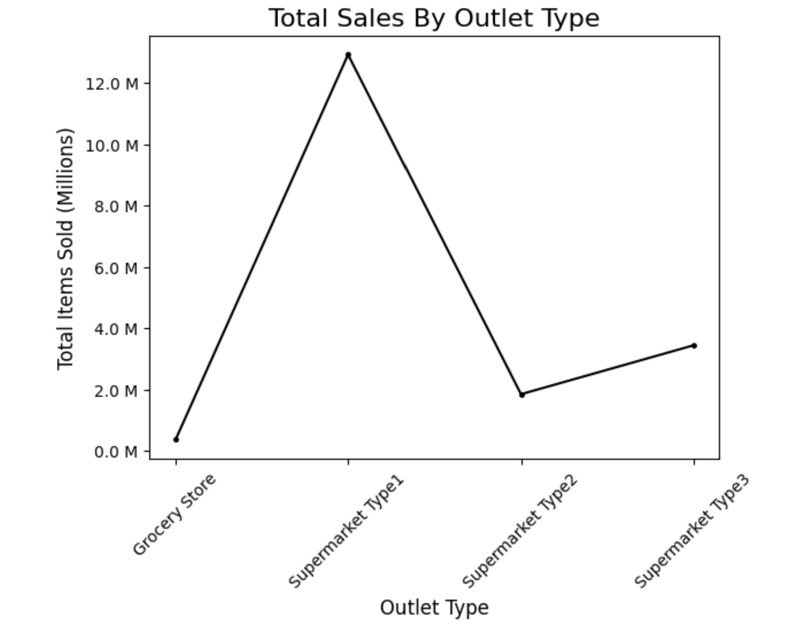
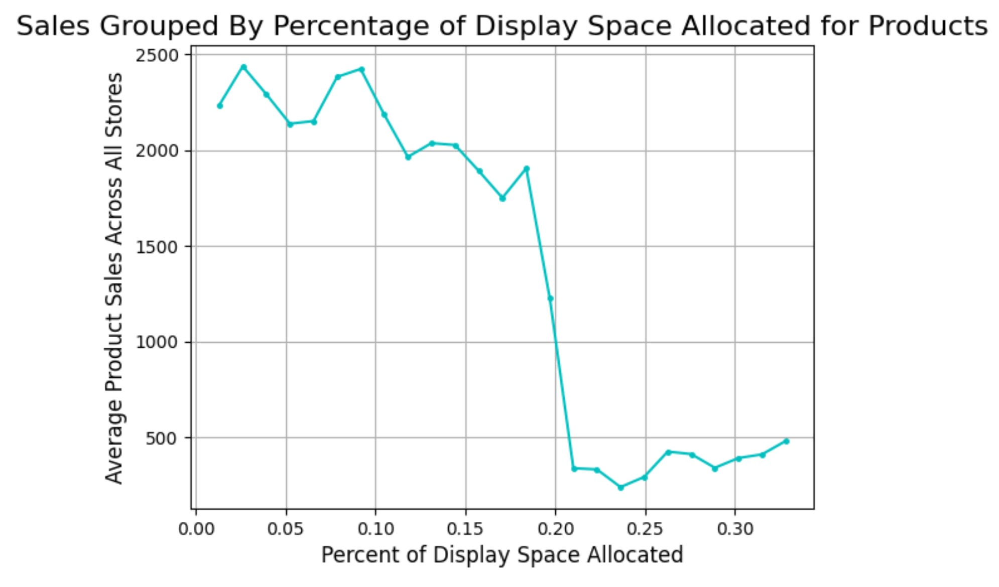
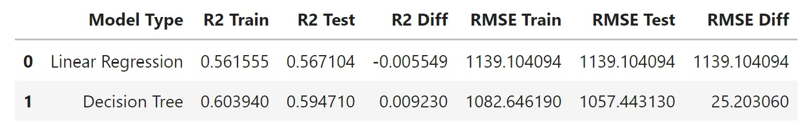

# Sales Predictions
## Subtitle describing the analysis 

**Tristan Conant**: 

### Business problem:

Retailers want to better understand product properties and outlet details and how they relate to sales trends. 

### Data:
[Food sales data](https://docs.google.com/spreadsheets/d/e/2PACX-1vQcO5VAKyttMX8k6NqLE5Q5wHBt1ZVvuQ-Emy8aAvUOlbLrt_dcvqbBnGLtI3fDP_gAgdlmlfed1c3i/pub?gid=883441261&single=true&output=csv)

## Methods
- Duplicate rows are dropped.
- Missing numerical data has been filled using the mean imputer while ordinal and categorical values have the most frewuent imputer applied to them.
- Inconsistencies in object columns have been statndardized without dropping columns across the dataset.

#### Sales by outlet type

> Vizualization clearly shows one supermarket type substantially outsells the rest.

#### Sales by percentage of space used for product display

> Surprisingly the data shows that products with the most display space had some of the lowest sales.

## Model

At this point metrics for linear regression and decision tree model show that both models are underfitting.

## Recommendations:

Based on the data my recommendation is to limit efforts put into product displays. If store expansion is the objective, I would recommend prioritizing Type 2 supermarkets.

## Limitations & Next Steps
I think the dataset could be expanded to include other features that might help identify shopping trends. Other models will be required for best results.

## Contact Information
Email: <me@tristanconant.com>

